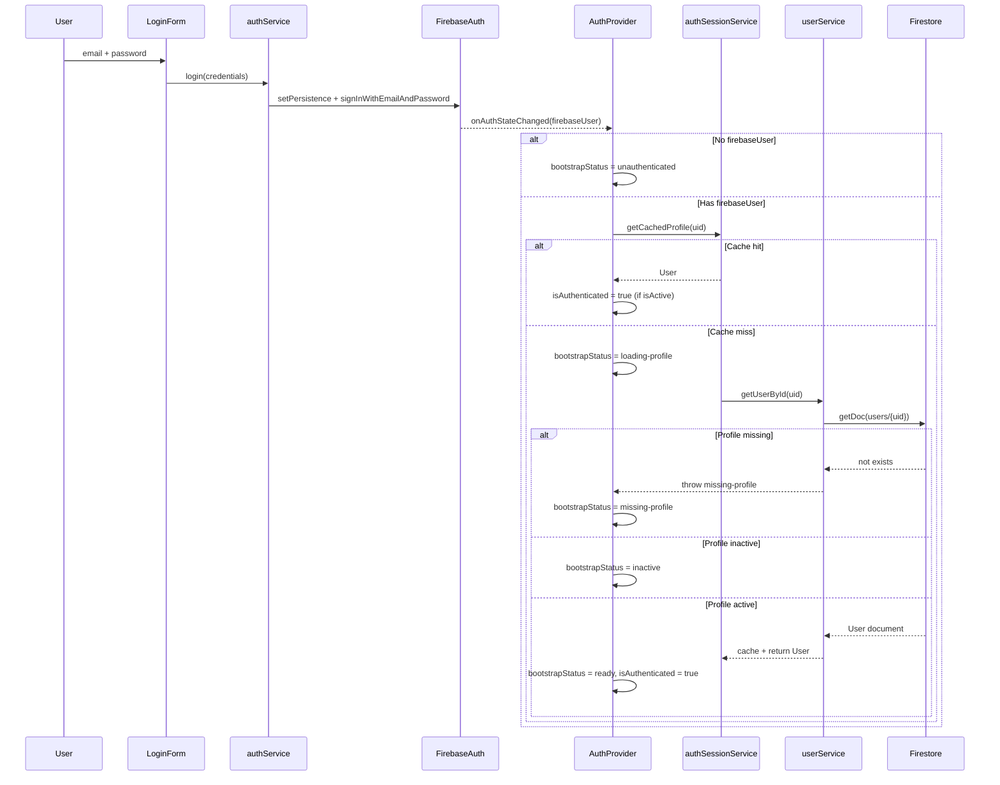
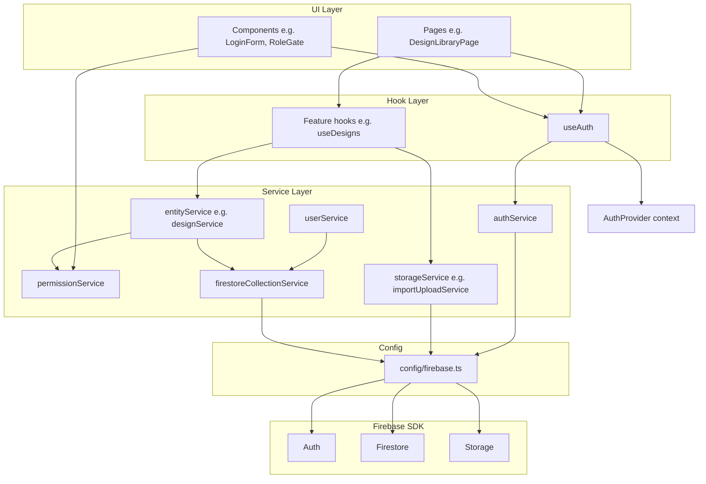
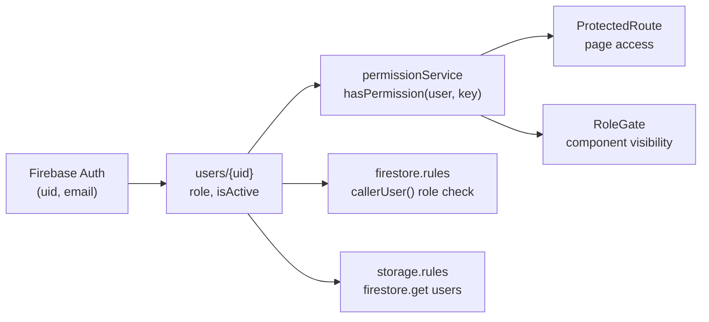

# 01 — Architecture

Labels: **Portable** unless marked **Fresh Prints–specific**.

---

## System Overview

Fresh Prints is an **Electron + React (Vite)** desktop app. The renderer talks directly to Firebase client SDKs (Auth, Firestore, Storage). There is no custom REST API for core data access.

```
┌─────────────────────────────────────────────────────────┐
│  Electron main process (window, IPC — not Firebase)      │
├─────────────────────────────────────────────────────────┤
│  React UI (components, pages)                          │
│       ↓ hooks (useAuth, feature hooks)                   │
│       ↓ services (authService, userService, …)           │
│       ↓ config/firebase.ts (single init)               │
├─────────────────────────────────────────────────────────┤
│  Firebase (Auth · Firestore · Storage)                   │
│  Optional: Callable Cloud Functions (user admin)         │
└─────────────────────────────────────────────────────────┘
```

**Portable:** Layered client → services → Firebase.
**Fresh Prints–specific:** Electron shell; Callable Functions for team user admin.

---

## Core Principles

### 1. Single Firebase initialization

**Portable.** One module creates the app and exports SDK instances.

- `src/renderer/src/config/env.ts` — validates env, builds `firebaseConfig`
- `src/renderer/src/config/firebase.ts` — `initializeApp` once; exports `auth`, `db`, `storage`

Never call `initializeApp` elsewhere. Services import from `config/firebase.ts`.

### 2. Auth identifies; Firestore user record authorizes

**Portable.**

| Layer | Responsibility |
|-------|----------------|
| Firebase Auth | Email/password login, `uid`, session persistence |
| Firestore `users/{uid}` | `role`, `isActive`, `displayName`, `email` |
| `permissionService` | Maps role → capabilities in the client |
| Security rules | Same role model enforced server-side |

A valid Auth session **without** a `users/{uid}` document results in `bootstrapStatus: "missing-profile"` — the user cannot use the app.

Source: `src/renderer/src/features/auth/context/AuthProvider.tsx`, `src/renderer/src/features/users/services/userService.ts`

### 3. Components never call Firebase directly

**Portable.**

| Layer | May call |
|-------|----------|
| Components | Hooks, other components |
| Hooks | Services, context |
| Services | `config/firebase`, Firestore/Auth/Storage SDK |
| Components | ❌ `firebase/*`, ❌ `getDoc`, ❌ `uploadBytes` |

### 4. Firestore = metadata; Storage = files

**Portable.**

- Firestore documents store **canonical storage paths** (e.g. `/originals/{id}.png`), not permanent download URLs.
- Upload services write bytes to Storage, then entity services persist paths in Firestore.
- Display code resolves paths to download URLs at read time (`getDownloadURL`), with optional in-memory caching.

Sources:

- `shared/constants/design/designStoragePaths.ts` — path builders
- `src/renderer/src/features/imports/services/importUploadService.ts` — upload
- `src/renderer/src/features/designs/services/designDerivativeUrlService.ts` — URL resolution

### 5. Security enforced in rules, not UI alone

**Portable.**

`ProtectedRoute` and `RoleGate` improve UX; `firestore.rules` and `storage.rules` are authoritative.

### 6. Env validation fails fast

**Portable.** `validateFirebaseEnv()` runs at module load; missing `VITE_FIREBASE_*` throws immediately.

Source: `src/renderer/src/config/env.ts`

---

## Auth Bootstrap Flow

After login or session restore, the app loads the Firestore profile before setting `isAuthenticated: true`.



**Key files:**

- `src/renderer/src/features/auth/services/authService.ts`
- `src/renderer/src/features/auth/context/AuthProvider.tsx`
- `src/renderer/src/features/auth/services/authSessionService.ts`
- `src/renderer/src/features/auth/components/AuthBootstrapGate.tsx`
- `src/renderer/src/features/auth/types/auth.types.ts` — `AuthBootstrapStatus`, `shouldShowBootstrapScreen`

**Persistence:** `browserLocalPersistence` (remember me) vs `browserSessionPersistence` — `authService.ts`, `authPreferencesService.ts`

**App wiring:** `src/App.tsx` wraps `HashRouter` with `AuthProvider`. `AppRoutes.tsx` wraps routes with `AuthBootstrapGate`.

---

## Component → Service → Firebase Layering



**Rules:**

1. `permissionService` is pure logic — no Firebase imports.
2. Entity services accept `caller: User` and check permissions before reads/writes.
3. `firestoreCollectionService` is the only place that maps logical collection keys to `collection(db, name)`.

---

## Auth → Profile → Permissions Flow



### User roles (**Fresh Prints–specific** names; **portable** pattern)

From `src/renderer/src/features/users/types/user.types.ts`:

| Role | Typical use in Fresh Prints |
|------|----------------------------|
| `owner` | Full control; protected account |
| `admin` | Staff + user management (limited) |
| `helper` | Staff operations |
| `customer` | Portal-facing (not desktop app) |

Desktop app access requires active staff role — `permissionService.canAccessDesktopApp()` (`owner`, `admin`, `helper`).

Adapt role names and capability matrix in a new app; keep the **same split**: Auth UID + Firestore profile + permission service + rules.

### UI gates

| Component | Path | Behavior |
|-----------|------|----------|
| `AuthenticatedLayout` | `src/renderer/src/routes/AuthenticatedLayout.tsx` | Redirect to `/login` if not authenticated |
| `AuthBootstrapGate` | `src/renderer/src/features/auth/components/AuthBootstrapGate.tsx` | Block UI until profile loaded or error |
| `ProtectedRoute` | `src/renderer/src/features/auth/components/ProtectedRoute.tsx` | Page-level `permission` check |
| `RoleGate` | `src/renderer/src/features/permissions/components/RoleGate.tsx` | Conditional render / fallback |

---

## Upload Workflow (Metadata vs Files)

**Pattern exemplar:** design import pipeline. **Fresh Prints–specific** paths; **portable** sequence.

```mermaid
sequenceDiagram
  participant ImportFlow
  participant importUploadService
  participant Storage
  participant designService
  participant Firestore
  participant designDerivativeStorageService
  participant designDerivativeUrlService
  participant UI

  ImportFlow->>designService: createDesign(caller, metadata + empty paths)
  designService->>Firestore: setDoc(designs/{id}) with originalPath, thumbnailPath
  ImportFlow->>importUploadService: uploadOriginalPng(designId, bytes)
  importUploadService->>Storage: uploadBytes(/originals/{id}.png)
  ImportFlow->>designDerivativeStorageService: uploadThumbnailWebp / uploadPreviewWebp
  designDerivativeStorageService->>Storage: uploadBytes(/thumbnails|previews/{id}.webp)
  ImportFlow->>designService: updateDesign(paths)
  designService->>Firestore: updateDoc paths only

  Note over Firestore,Storage: Firestore holds paths; Storage holds bytes

  UI->>designDerivativeUrlService: getThumbnailUrl(design)
  designDerivativeUrlService->>Storage: getDownloadURL(path)
  Storage-->>UI: temporary HTTPS URL (cached in session)
```

**Important:**

- Persist **catalog paths** in Firestore (`/originals/foo.png`), not download URLs (they expire).
- Path builders live in shared constants: `shared/constants/design/designStoragePaths.ts`
- Storage rules validate path shape and content type: `storage.rules`

---

## Firestore Document Standards

**Portable** conventions from `designService` and shared utils:

| Convention | Implementation |
|------------|----------------|
| Document `id` field matches doc ID | `request.resource.data.id == designId` in rules |
| Audit fields | `createdAt`, `updatedAt` (`serverTimestamp()`), `createdBy`, `updatedBy` |
| No `undefined` in writes | `withoutUndefinedFields()`, `assertNoUndefinedFirestoreFields()` |
| Clear optional fields on update | `deleteField()` |
| Map snapshots defensively | `mapUserDocument`, `mapDesignDocument` validate types |
| User-safe errors | `getFirestoreErrorMessage()` |

Sources:

- `src/renderer/src/features/firebase/utils/firestoreDocument.ts`
- `src/renderer/src/features/firebase/utils/firestoreTimestamp.ts`
- `src/renderer/src/features/firebase/utils/firestoreErrorMessage.ts`

---

## Users Collection Contract

**Portable** (minimal replication).

```
users/{userId}   // userId MUST equal Firebase Auth uid
```

Required fields (enforced in `userService.mapUserDocument` and rules):

- `email`, `displayName`, `role`, `isActive`, `createdAt`, `updatedAt`
- Optional: `createdBy`, `updatedBy`

Client writes to `users` are **denied** in `firestore.rules` (`allow create, update, delete: if false`). Provisioning uses Firebase Console + Firestore manual doc, or Admin SDK in Cloud Functions.

See `docs/architecture/DATA_MODEL.md` (User Collection) and `docs/workflow/setup/auth-testing-guide.md`.

---

## Optional: Cloud Functions Touchpoints

**Fresh Prints–specific** but useful as a replication reference for team provisioning.

| Function | Path | Purpose |
|----------|------|---------|
| `createTeamUser` | `functions/src/createTeamUser.ts` | Create Auth user + `users` doc + invitation email |
| `updateTeamUser` | `functions/src/updateTeamUser.ts` | Update role, `isActive`, sync Auth `disabled` |

**Not required** for minimal auth. Console bootstrap of first admin is sufficient for development.

---

## Related Documentation

| Doc | Relevance |
|-----|-----------|
| `docs/architecture/ARCHITECTURE.md` | Layer boundaries |
| `docs/architecture/FIREBASE.md` | Extended Firebase standards (verify against code) |
| `docs/architecture/DATA_MODEL.md` | User entity contract |
| `docs/architecture/BACKEND.md` | Functions, env, deployment context |
| `docs/standards/SECURITY.md` | Rules philosophy |
