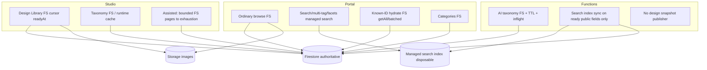

# Amendment 8 Phase 1B Revalidation — Retire Design Snapshots, Taxonomy Strategy

| Field | Value |
|-------|-------|
| Date | 2026-08-06 |
| Goal | `post-launch-catalog-and-processing-stability` |
| Phase | Amendment 8 Phase 1B architecture revalidation |
| Mode | Investigate → Revised Plan → Formal Review only |
| Starting HEAD | `71a4cec` |
| Branch | `fix/post-launch-catalog-and-processing-stability` |
| PR | #40 open / unmerged |
| Baseline | Amendment 8 Hybrid Plan + Phase 1A Signoff (`4ed41bc`+) + Amendment 9 P0 Signoff + server-read attribution |
| Production | **No** production, deploy, merge, cleanup, or Firebase mutation in this pass |

---

## 1. Executive conclusion

**Preferred architecture is feasible for ordinary Studio and Portal library browse — and is already largely landed in Phase 1A.** Design metadata must remain Firestore-authoritative; images remain in Storage; AI drafts remain durable Firestore `aiSuggestions` until staff approval.

**What still blocks full snapshot retirement:**

1. Portal **text search**, **multi-tag AND**, and **tag facets / narrowed counts** still read `generated/portal-catalog/**` via `portalCatalogAssetService`.
2. Portal **known-ID card hydration** (`getReadyDesignsByIds`) still prefers generated card buckets when the flag is on.
3. Portal **categories** still *prefer* `generated/catalog-reference/client/**` before Firestore fallback.
4. Live **publishers** still scan categories+tags+ready designs on ready-boundary / index-filter design writes (~25 full pubs / ~28.8K reads observed for a 45-design paced batch — Amendment 9 attribution).

**What does *not* need a design snapshot:**

- Studio Design Library (already `useDesigns` Firestore).
- Studio taxonomy display / AI Review taxonomy UI (already Firestore via `useGeneratedDesignLibraryTaxonomy` internals).
- Assisted Creation ready picker (already Firestore pagination-to-exhaustion; export name preserved).
- Portal ordinary browse / category / single-tag / Discover home / Global OG (already Firestore).
- AI enrichment taxonomy load (`loadAiCatalogReferenceSnapshot` is **already Firestore-only** with 5‑min TTL + in-flight dedupe; Storage AI reference object is written by the publisher but **not read** by current AI runtime).

**Search / multi-tag / facets:** Option C (Firestore-only preserving current behavior) is **rejected**. Recommended steady state is **Option A — Hybrid (Firestore browse + managed search)**. Option B (product simplify) is the only Firestore-only alternative and requires an explicit owner product decision listing lost behaviors.

**Tags-only Storage snapshot:** Feasible as a *narrow* package for approved tag definitions, but **not required** for AI (Strategy 2 already shipped) and **cannot** replace Portal facets (counts are design-derived). Plan recommendation: **do not rebuild a tags-only Storage package for AI**; keep Strategy 2; retire `catalog-reference` writers with design publishers unless a later measured cold-start problem reopens Strategy 1.

**Design snapshot necessity (steady state):** **None.** No full-catalog design card/index/search snapshot should remain.

**Amendment 9 P4:** Reduce to a **short transition guard** during Stages 1–3 while publishers are retained for rollback. Not a permanent parallel architecture. Becomes **unnecessary at Stage 4** when portal-catalog publishers are retired. Do **not** treat P4 as a substitute for Phase 1B consumer cutover.

---

## 2. Exact current architecture (post–Phase 1A)

```mermaid
flowchart TB
  subgraph Studio
    DL[Design Library useDesigns FS]
    TAX[useGeneratedDesignLibraryTaxonomy FS]
    AC[useGeneratedReadyDesigns FS page-to-exhaustion]
    AIUI[AI Review taxonomy UI via TAX]
  end

  subgraph Portal
    BROWSE[Ordinary/category/single-tag/discovery FS listReadyDesignsPage]
    HOME[Discover home listHomeDiscoveryPool FS]
    SEARCH[Search + multi-tag portalCatalogAssetService]
    FACETS[Tag facets / narrowed generated]
    BYID[getReadyDesignsByIds generated-first + FS fallback]
    CATS[listActiveCategories generated-first + FS fallback]
  end

  subgraph Functions
    AI[loadAiCatalogReferenceSnapshot FS 5min cache]
    PUB[publishCatalogSnapshots portal-catalog + catalog-reference]
    OG[getPortalGlobalOpenGraph FS sample]
    CLASS[portalCatalogChangeClassifier]
  end

  FS[(Firestore designs/tags/categories)]
  ST[(Storage images)]
  GEN_P[(generated/portal-catalog/**)]
  GEN_R[(generated/catalog-reference/**)]

  DL --> FS
  TAX --> FS
  AC --> FS
  BROWSE --> FS
  HOME --> FS
  OG --> FS
  AI --> FS
  SEARCH --> GEN_P
  FACETS --> GEN_P
  BYID --> GEN_P
  BYID -.->|missing IDs| FS
  CATS --> GEN_R
  CATS -.->|fallback| FS
  CLASS -->|index-filter / ready boundary| PUB
  PUB --> GEN_P
  PUB --> GEN_R
  DL --> ST
  BROWSE --> ST
```

---

## 3. Exact target architecture

Optional later: compact **tags-only** Storage object published **only** on tag-definition changes — **not** on design approval. Not in the recommended minimum target.

---

## 4. Complete source-path matrix (remaining / disposition)

Baseline: Amendment 8 §11 75-path matrix. **Revalidation delta after Phase 1A (`4ed41bc`+):** Studio generated asset service, Electron catalogAsset IPC, card-override Studio path, and generated ready-index loaders are **already absent**. This matrix lists **remaining** physical paths at `71a4cec` plus KEEP paths that prove Firestore authority. Do not re-count deleted Phase 1A rows as live consumers.

Action values: **KEEP** · **EDIT** · **DELETE** · **DEAD** (unreachable but present).

### 4.1 Portal — active generated readers

| Consumer/path | App | Generated object read | Purpose | Authoritative replacement | Keep/edit/delete | Phase |
|---|---|---|---|---|---|---|
| `apps/portal/features/catalog/services/portalCatalogAssetService.ts` | portal | `generated/portal-catalog/**`, `generated/catalog-reference/**` | Manifest, cards, search shards, tag filters, facets, client taxonomy | Managed search + FS browse/by-id/categories | DELETE after cutover | 1B Stage 1–5 |
| `apps/portal/features/catalog/services/portalCatalogAssetService.test.ts` | portal | n/a | Search pagination tests | Delete with service | DELETE | 1B |
| `apps/portal/features/catalog/services/catalogSnapshotFlags.ts` | portal | flag gate | `NEXT_PUBLIC_USE_GENERATED_CATALOG_SNAPSHOTS` | Remove after last consumer | DELETE last | 1B Stage 1 |
| `apps/portal/features/catalog/hooks/useCatalogDesigns.ts` | portal | `listMatchingDesigns` | Text + multi-tag pages | Managed search client | EDIT | 1B Stage 1 |
| `apps/portal/features/catalog/utils/catalogNeedsFullClientHydrate.ts` | portal | gate → generated path | `search` or `tags.length>1` | Rename/repurpose as “needs search provider” | EDIT | 1B |
| `apps/portal/features/catalog/services/catalogService.ts` `getReadyDesignsByIds` | portal | card buckets | Favorites, share, request items, Assisted mats | FS batched `getDoc`/`getAll` primary | EDIT | 1B Stage 1 |
| `apps/portal/features/catalog/services/catalogService.ts` `listActiveCategories` | portal | catalog-reference client | Category chips | Direct FS `isActive==true` only | EDIT | 1B Stage 1 |
| `apps/portal/features/catalog/services/catalogService.ts` `listApprovedTags` / `listNarrowedApprovedTags` | portal | tag facet + tag ID lists + cards | Facet modal | Managed search facets | EDIT | 1B Stage 1 |
| `apps/portal/features/catalog/services/catalogService.ts` `listAllReadyDesigns` | portal | none (FS loop ≤2000) | Deprecated hydrate helper | Keep deprecated or DELETE if unused | DELETE preferred (no callers) | 1B |
| `apps/portal/features/catalog/components/CatalogTagFilterModal.tsx` | portal | via listNarrowed | Narrowed facets UI | Search provider facets | EDIT | 1B |
| `apps/portal/features/catalog/hooks/useCatalogTags.ts` | portal | listApprovedTags | Tag modal open | Search facets | EDIT | 1B |
| `apps/portal/features/catalog/hooks/useCatalogCategories.ts` | portal | listActiveCategories | Category list | FS | EDIT | 1B |
| `apps/portal/features/favorites/pages/FavoritesPageContent.tsx` | portal | getReadyDesignsByIds | Favorite cards | FS by-id | EDIT (via service) | 1B |
| `apps/portal/features/catalog/pages/ShareDesignPortalPageContent.tsx` | portal | getReadyDesignsByIds | Share | FS by-id | EDIT (via service) | 1B |
| `apps/portal/features/catalog/hooks/useCatalogDesignDeepLink.ts` | portal | getReadyDesignsByIds | Deep link | FS by-id | EDIT (via service) | 1B |
| `apps/portal/features/print-requests/hooks/useWorkingCurrentRequestItems.ts` | portal | getReadyDesignsByIds | Request line cards | FS by-id | EDIT (via service) | 1B |
| `apps/portal/features/print-requests/services/portalPrintRequestService.ts` | portal | getReadyDesignsByIds | Request design hydrate | FS by-id | EDIT (via service) | 1B |
| `apps/portal/features/account/services/accountReusableDesignsService.ts` | portal | getReadyDesignsByIds | Reusable IDs | FS by-id | EDIT (via service) | 1B |
| `apps/portal/features/assisted-creation/components/AssistedCreationDetailPanels.tsx` | portal | getReadyDesignsByIds | Catalog-share mats | FS by-id | EDIT (via service) | 1B |
| `apps/portal/features/assisted-creation/components/AssistedCreationStatusPanel.tsx` | portal | getReadyDesignsByIds | Status panel mat | FS by-id | EDIT (via service) | 1B |
| `portalCatalogAssetService.listDiscoverDesigns` | portal | discover.json | Legacy Discover | **DEAD** (home uses FS) | DELETE with service | 1B |

### 4.2 Portal — already Firestore (KEEP; no generated design dependency)

| Path | Purpose | Notes |
|---|---|---|
| `catalogService.listReadyDesignsPage` (+ readyAt completeness) | Ordinary browse | Page 40; cursor; no generated |
| `catalogService.listHomeDiscoveryPool` | Discover home | FS pools |
| `catalogService.listReadyDesignsPageWithSortFallback` | Index fallback | FS |
| `useCatalogDesigns` ordinary branch | Browse when not search/multi-tag | FS |
| Details via FS design doc / by-id fallback | Detail | FS |
| Global OG Function | Social rotation | FS sample — KEEP |

### 4.3 Studio — Phase 1A already cut over

| Path | Status | Notes |
|---|---|---|
| `DesignLibraryPage` + `useDesigns` | KEEP | Firestore-authoritative |
| `useGeneratedDesignLibraryTaxonomy.ts` | KEEP name / FS internals | Categories+approved tags from services |
| `useGeneratedReadyDesigns.ts` | KEEP name / FS page-to-exhaustion | Assisted picker completeness |
| `studioCatalogAssetService` / Electron `catalogAsset*` / `fetchCatalogAssetJson` | **Already deleted** (Phase 1A) | Confirm absent at `71a4cec` |
| `studioGeneratedCardOverrideService` / generatedReadyDesignLoad/Mapping | **Already deleted** | Phase 1A |

### 4.4 Functions / shared / rules / scripts

| Path | Generated role | Disposition | Phase |
|---|---|---|---|
| `functions/src/catalogSnapshots/publishCatalogSnapshots.ts` | Writes portal-catalog + catalog-reference; coordination `snapshotPublicationState` | DELETE source after 1B cutover; live delete Stage 4 | 1B→4 |
| `functions/src/catalogSnapshots/portalCatalogChangeClassifier.ts` (+test) | Schedules full vs override vs skip | DELETE with publisher | 4 |
| `functions/src/catalogSnapshots/snapshotBuilders.ts` (+tests) | Build assets | DELETE | 4 |
| `functions/src/catalogSnapshots/publicationRecovery.ts` (+test) | Catch-up | DELETE | 4 |
| `functions/src/catalogSnapshots/*` remaining tests | Publisher tests | DELETE | 4 |
| `functions/src/index.ts` snapshot exports | Live surface | MANUAL un-export after cutover | Stage 1 source / Stage 4 live |
| `functions/src/ai/loadAiCatalogReferenceSnapshot.ts` | **FS-only** taxonomy | KEEP (Strategy 2) | — |
| `functions/src/ai/aiEnrichmentRuntimeCache.ts` | 60s cache over loader | KEEP | — |
| `functions/src/getPortalGlobalOpenGraph.ts` | FS library sample | KEEP | — |
| `packages/shared/src/catalog-snapshots/*` | Parsers/types/overrides | DELETE after last Portal reader | 1B Stage 1–5 |
| `tests/firebase/catalogSnapshot.rules.test.ts` | Rules | DELETE with Stage 5 Rules edit | 5 |
| `functions/scripts/retry-portal-catalog-publication-prod.mjs` | Ops | DELETE with publisher | 4 |
| Storage Rules `generated/portal-catalog/**`, `generated/catalog-reference/**` | Public read / AI private | Narrow or remove Stage 5 | 5 |
| Firestore Rules `snapshotPublicationState` | Coordination | Remove Stage 5 | 5 |

### 4.5 Consumer count (runtime generated reads)

Two equivalent aggregations (independent inventory re-derivation):

| Class | Count | Definition |
|---|---:|---|
| **Design-snapshot consumer surfaces** | **8** | Live call chains that read `generated/portal-catalog/**`: (1) search/multi-tag via `listMatchingDesigns`, (2) tag facets via `listApprovedTags`, (3) narrowed facets via `CatalogTagFilterModal`, (4) Favorites by-id, (5) print-request/working-items by-id, (6) share/deep-link by-id, (7) Assisted Portal by-id, (8) account reusable by-id |
| **Taxonomy-only consumer surfaces** | **1** | `listActiveCategories` → `loadClientTaxonomy` (`generated/catalog-reference/client/**`) with FS fallback |
| Service entry points (underlying) | **5** | `listMatchingDesigns`, `getDesignsByIds`, `loadClientTaxonomy`, `listTagFacets`, `listNarrowedTagFacets` |
| Dead generated entry point still in source | **1** | `listDiscoverDesigns` (no callers; Discover home is FS) |
| Studio generated design readers | **0** | — |
| AI Storage taxonomy readers | **0** | FS loader only |
| Live publishers still exporting | **5** | 3 write triggers + `rebuildCatalogSnapshots` + `retryPortalCatalogPublication` |

---

## 5. Design-versus-taxonomy data classification

| Field / asset | Class | Authoritative source | Must stay generated? | FS query OK? | Runtime cache OK? | Behavior if removed |
|---|---|---|---|---|---|---|
| Design cards / buckets | Design catalog | `designs/{id}` | **No** | Yes (by-id / page) | Short page/by-id cache | Prefer FS primary |
| Ready index / recent pages / category pages | Design catalog | Firestore queries | **No** | Yes | Page cache | Already FS ordinary |
| Search shards / term→IDs | Derived search | Managed search (target) | No (today yes) | **No** at scale | Provider | Need Option A or B |
| Tag facet counts / narrowed co-occurrence | Derived search | Ready designs’ tags | **No** as taxonomy package | Incomplete without scan | Provider facets | Need Option A or B |
| Per-design tag assignments | Design catalog | design.tags | No | Yes | — | FS |
| Approved tag name/aliases/`preferredWhen`/status | Tag taxonomy | `tags` | Optional Strategy 1 | Yes (1121 docs) | Yes (5–60 min) | AI already FS |
| Categories active list | Category taxonomy | `categories` | **No** | Yes (~18) | Yes | Direct FS |
| AI settings | AI config | settings doc | **No** | Yes (1) | 60s | Already cached |
| `snapshotPublicationState` | Publication coordination | Firestore | Retire with publishers | — | — | Stage 4–5 |
| Manifest/version metadata | Snapshot-only compatibility | Storage | Retire | — | — | Stage 5 |

**Tags-only package may contain:** canonical name, aliases, `preferredWhen`, status/version, package generation metadata.  
**Must not contain:** design IDs, cards, ordering, ready indexes, image paths, titles, descriptions, category assignments, per-design tags, facet counts.

**Categories & AI settings:** remain outside any tag package (evidence: small collections; AI already loads them via FS cache).

---

## 6. Studio replacement design

| Surface | Current | Target | Status |
|---|---|---|---|
| Ordinary ready library | `useDesigns` `status==ready` `readyAt desc` + `__name__` cursor; completeness→`createdAt` | Same | **Done (1A)** |
| Archived | Existing archived query path | Same | KEEP |
| Category/tag filter | Client filter over loaded page / taxonomy from FS | Same (staff scale) | KEEP |
| Search | Client filter over page / Assisted full set | Same for Studio | KEEP |
| Pagination | Page 100; no loadAll on Library | Same | KEEP |
| Details / lightbox | Authoritative Design docs | Same | KEEP |
| Assisted picker | `useGeneratedReadyDesigns` FS pagination-to-exhaustion | Same; document growth risk | KEEP |
| Favorites / ID hydrate | N/A Studio snapshot | — | — |
| AI Review taxonomy | Hook name → FS lists | Same | KEEP |

**Steady-state Studio contract:** met today. No generated ready index. No per-card listener storm. Immediate visibility after approval via FS write (no snapshot wait). No idle polling.

**Assisted completeness:** pagination-to-exhaustion is required so catalogs > one page are not truncated. At very large ready counts, add a future bounded search/filter UX — **out of Phase 1B** unless owner expands scope; not a reason to restore a design snapshot.

---

## 7. Portal replacement design

| Experience | Current source | Replacement |
|---|---|---|
| 1 Ordinary ready browse | FS `readyAt` + completeness | KEEP |
| 2 Pagination | FS cursor page 40 | KEEP |
| 3 Category | FS `categoryId` + readyAt | KEEP |
| 4 Single-tag | FS `array-contains` + readyAt | KEEP |
| 5 Multi-tag | Generated intersection | **Managed search AND** (Option A) or product limit to 1 tag (Option B) |
| 6 Text search | Generated shards | **Managed search** or remove (B) |
| 7 Facets/counts | Generated facet + narrowed | **Managed search facets** or remove exact global counts (B) |
| 8 Discover/recent | FS `listHomeDiscoveryPool` | KEEP |
| 9 Favorites | Favorites IDs + `getReadyDesignsByIds` (generated-first) | **FS by-id primary** (batched) |
| 10 Design details | FS / by-id | FS |
| 11 Share routes | by-id + OG | FS by-id |
| 12 Global OG | Function FS sample | KEEP |
| 13 Add to Current Request | by-id hydrate | FS by-id |
| 14 Reuse design IDs in request | by-id | FS by-id |

**Ordinary-library contract:** already met for non-search paths. Stage 1 must not regress readyAt ordering, completeness fallback, page size, or introduce N+1 `getDoc` per card on browse grids.

**Security:** public guest browse remains Rules-gated ready designs; search index documents are **not** an auth boundary; mutations always validate Firestore.

---

## 8. Search / multi-tag / facet recommendation

### Option A — Firestore browse + managed search (**RECOMMEND**)

- FS: ordinary / category / single-tag / discovery / details / by-id.
- Provider: text, multi-tag AND, facets + narrowed counts.
- Index: ready-only public allowlisted fields; disposable; sync from design writes that change public catalog fields.
- Keys: search-only public; Admin in Secret Manager only.

### Option B — Firestore-only with product simplification

Must lose or weaken **all** of:

1. Free-text search across title/description (or replace with trivial prefix-only if fields exist — **not** current shard behavior).
2. Multi-tag AND (`selectedTags.length > 1`).
3. Exact global “tags with ready counts” facet list.
4. Exact narrowed co-occurrence facet counts while selecting tags.

Owner-visible: tag modal becomes “approved tag names without live ready counts” **or** single-tag-only filtering; search box removed or severely limited.

### Option C — Firestore-only preserving current behavior

**Rejected.** Requires full-catalog hydrate, ≤2000 local filter, N+1 counts, combinatorial indexes, or a Firestore “search index” that is another design snapshot.

### Option D — Minimal server callable

**Rejected as primary search.** Bounded callable can do single-tag/page FS queries already done client-side; cannot provide arbitrary full-text + multi-tag + exact facets without scanning or recreating an index. Guest abuse + read cost unbounded without the same provider economics.

**Plan recommendation: Option A.** Implementation blocked on owner provider choice (Algolia recommended; Typesense Cloud acceptable) — same as ADR-FP-120-S.

---

## 9. AI taxonomy recommendation

### Current flow (source-proven)

1. Image: AI enrichment uses design derivative Storage path (unchanged; not portal snapshot).
2. Design fields: Firestore design doc.
3. Tags: `loadAiCatalogReferenceSnapshot` → `tags where status==approved` (~1121).
4. Categories: same loader → `categories where isActive==true` (~18).
5. Settings: `aiEnrichmentRuntimeCache` 60s.
6. In-flight: promise dedupe in loader + runtime cache.
7. TTL: loader 5 min; runtime tag/category/settings caches 60s.
8. Writes: durable `aiSuggestions` on design (pre-approval).
9. Approval: copies into canonical fields → status ready.
10. Publication: classifier returns `operational` when neither ready-boundary, `INDEX_FILTER_FIELDS` (title/description/categoryId/tags/createdAt/readyAt), nor `CARD_ONLY_FIELDS` change — so a pure `aiSuggestions` / processing-progress write **does not** schedule portal-catalog publication. Approval/index-filter / card-only → **still** schedules override or full publish today.

### Strategy 1 — compact tags-only Storage snapshot

Pros: one Storage GET vs ~1121 FS reads on cold miss; publish only on taxonomy edits.  
Cons: new publisher surface; invalidation/fallback complexity; **AI already does not use Storage**; portal facets still need design-derived counts elsewhere.

### Strategy 2 — Firestore + runtime cache (**RECOMMEND KEEP**)

Already shipped. Observed ~3 full loads / ~3.4K reads in 45-design window (secondary to ~28.8K snapshot pubs). Improving TTL alone (P3) is optional; **does not require Storage**.

**Owner preference for Strategy 1** is acknowledged but **not justified as better** than Strategy 2 for AI given current source. If owner still wants Strategy 1 later, it must be tags-only, publish-on-taxonomy-change-only, with FS fallback — separate from design snapshot retirement.

---

## 10. Publication-trigger retirement plan

| Write/event | Publicly visible? | Update design library? | Update tag package? |
|---|---:|---:|---:|
| Import create | No | No | No |
| Derivative update | No | No | No |
| AI processing progress | No | No | No |
| `aiSuggestions` update | No | No | No (classifier operational today) |
| `needs_review` | No | No | No |
| Rejection | No | No | No |
| Approval → ready | Yes | **FS write sufficient** (+ search upsert if Option A) | No |
| Ready title/description | Yes | FS (+ search update) | No |
| Ready category/tags | Yes | FS (+ search update) | No unless tag **definition** changed |
| Ready artwork/background | Yes | FS (+ search if indexed) | No |
| Archive/restore | Yes | FS (+ search delete/upsert) | No |
| Tag definition edit | Taxonomy | No design snapshot | Yes **only if** Strategy 1 chosen; else FS cache invalidate |
| Category definition edit | Category | FS cache invalidate | No tag package |

**Steady state:** retire all **design** publication triggers and portal-catalog publisher Functions. Retire catalog-reference publisher unless Strategy 1 is explicitly chosen (recommend retire both).

---

## 11. 45-design cost comparison (source-grounded)

Constants from Amendment 9 attribution + source: T≈1121 tags, C≈18 categories, R ready designs during batch (~0→44), page sizes Studio 100 / Portal 40.

### Current (observed upper shape)

| Component | Bound |
|---|---|
| Portal full publications | ~**25** × ~(C+T+R+coord) ≈ **~28.8K** FS reads |
| AI taxonomy full loads | ~**3** × ~1140 ≈ **~3.4K** FS reads |
| AI suggestion writes | ~45 design writes |
| Approval writes | ~45 |
| Client Studio pages | O(pages × ≤101) — not snapshot |
| Portal browse (if opened) | O(page) FS — not snapshot |
| Storage image reads | per viewed thumb (unchanged) |

### Target

| Component | Bound |
|---|---|
| Design snapshot schedules / full pubs | **0** |
| AI taxonomy | **≤1 cold** ~1140 FS reads per instance TTL window; then cache hits |
| AI suggestion writes | ~45 |
| Approval writes | ~45 |
| Search upserts (Option A) | ~45 idempotent index writes (not C+T+R scans) |
| Studio one library page | ≤101 FS reads |
| Portal ordinary page (when browsed) | ≤41 FS reads (+ optional count) |
| Taxonomy rebuild on approval | **0** |
| Remaining cost | FS page reads, Storage thumbs, search queries when customers search — **not zero** |

---

## 12. Security analysis

- Guest Portal must only see ready public fields; Rules remain source of truth.
- Managed search: search-only keys; referrer/app restrictions; Admin keys never in client.
- Index is not authorization; Add-to-Request / mutations validate Firestore.
- Do not widen Storage Rules during retirement; Stage 5 dry-run cleanup.
- No secrets in generated JSON or search records.
- AI pre-approval fields must not become public via accidental index inclusion.

---

## 13. Failure / outage behavior

| Failure | Behavior |
|---|---|
| Managed search down | Ordinary FS browse continues; search/facets show explicit unavailable — **no** silent empty-as-success with fake zero facets |
| Search index stale | FS browse still correct; reconcile job; details validate FS |
| Taxonomy FS cold | AI uses existing loader fallback; jobs share in-flight |
| Publisher retained during Stage 1–3 | Rollback path; still costs pubs until Stage 4 |
| Flag `USE_GENERATED=false` | Today breaks search/facets (hard fail) — Stage 1 must replace before forcing false in prod |

---

## 14. Index requirements

Existing Portal/Studio ready composites (`status+readyAt+__name__`, category, single-tag, discovery sorts) **KEEP**.

New for Option A: provider-side inverted index (not Firestore composite explosion).

No new unbounded `array-contains-any` multi-tag Firestore strategy.

---

## 15. Cache and deduplication contracts

| Cache | Contract |
|---|---|
| Portal page cache | Existing ~15s query-key + in-flight |
| By-id hydrate | Prefer batch FS; short TTL OK; no card-bucket dependency |
| AI taxonomy | Keep in-flight dedupe; TTL ≥60s (optional lengthen as P3) |
| Search client | Debounce typing; one request per submit |
| Forbidden | Full-catalog client cache; recreating snapshot under new name |

---

## 16. Rollout stages

### Stage 1 — Source replacements (no Firebase delete)

Split so search-provider delay does not block removing the most harmful design-card dependency:

**Stage 1a — unblocked by D1 (can Implement after this Plan’s Review approval):**

- Make `getReadyDesignsByIds` **Firestore-primary** (batched/`getAll`/existing per-doc path); stop preferring card buckets.
- Make `listActiveCategories` **Firestore-only** (drop generated-first).
- Delete or stop exporting dead `listDiscoverDesigns`.
- Keep publishers deployed for rollback; search/multi-tag/facets may still use generated assets.
- Assert Studio + Portal ordinary browse remain zero design-snapshot dependency (already true).

**Stage 1b — blocked on owner D1 (Option A provider or Option B product cuts):**

- Wire Portal search/multi-tag/facets to managed search **or** Option B UX.
- Then remove remaining `portalCatalogAssetService` generated reads and `catalogSnapshotFlags`.
- Instrument zero active Portal design-snapshot reads (including facets/search).

### Stage 2 — Local verification (`fresh-prints-dev`)

- Studio + Portal localhost; generated design reads disabled or traced to zero.

### Stage 3 — Owner development QA

Checklist: Studio library/archived/filters/Assisted/AI Processing/AI Review; Portal browse/category/tag/multi-tag/search/facets/Discover/favorites/details/share/Add to Request/OG/artwork mats/read budgets; Amendment 9 P0 regression; protected behaviors listed below.

### Stage 4 — Live publisher retirement (separate human approval)

- Read-only inventory `fresh-prints-dev` then `fresh-prints-prod` Functions.
- Exact allowlist delete: portal-catalog + catalog-reference publishers/triggers/callables/recovery.
- Rollback: redeploy prior Functions revision; generated objects may still exist.

### Stage 5 — Generated-data cleanup (separate dry-run Plan)

- Dry-run delete `generated/portal-catalog/**` and design-related `generated/catalog-reference/**`.
- Remove `snapshotPublicationState` + generated Rules after rollback window.
- Retain tags-only package **only if** Strategy 1 was explicitly accepted (default: retain nothing).

### Stage 6 — Production promotion

Separate authorization after development Signoff. **Not** this pass.

---

## 17. Rollback strategy

1. Stage 1–3: re-enable generated readers + keep publishers (flag / revert commit).
2. Stage 4: redeploy publisher Functions; do not require regenerated objects if FS paths healthy.
3. Stage 5: stop cleanup; objects may be restored from backup only if owner has backup — prefer not needing objects if FS paths are primary.
4. Never leave Portal with search hard-fail and no FS/provider replacement.

---

## 18. Test plan (Implement phase — not this pass)

- Unit: search gate, by-id FS primary, classifier no longer needed once deleted.
- Portal containment tests updated (no `listMatchingDesigns`).
- Studio authoritative-source tests remain green.
- Amendment 9 P0 reconciliation tests re-run.
- No full build suite required in this Plan-only pass (per usage instructions).

---

## 19. Human checkpoints

1. **`[NEEDS OWNER DECISION]`** Option A provider vs Option B product cuts.
2. Confirm AI Strategy 2 KEEP (or explicitly demand Strategy 1 tags-only).
3. Stage 4 Function deletion approval (dev then prod).
4. Stage 5 Storage cleanup dry-run approval.
5. Stage 6 production promotion.
6. No merge of PR #40 without separate approval.

---

## 20. `[NEEDS OWNER DECISION]`

| ID | Decision | Default if deferred |
|---|---|---|
| D1 | Option A managed search provider (Algolia vs Typesense) **or** Option B product simplification | **Block Implement** of search cutover |
| D2 | Keep AI on Strategy 2 (recommended) vs build Strategy 1 tags-only Storage | Default **Strategy 2** |
| D3 | Authorize Stage 4 publisher retirement after Stage 3 PASS | Block live Function delete |
| D4 | Whether to implement short P4 transition guard before Stage 1 lands | Default: **only if** Phase 1B Implement delayed; else skip straight to 1B Stage 1 |

---

## 21. `[NEEDS REPO CHECK]`

| Item | Why |
|---|---|
| Exact live Function names on `fresh-prints-dev` / `fresh-prints-prod` | Stage 4 allowlist — not queried this Plan-only pass |
| Whether `generated/catalog-reference/ai/**` still exists in Storage | Publisher may still write; AI does not read — inventory at Stage 4/5 |
| Search provider package/env scaffolding paths | Do not invent until D1 |
| Any hidden import of `listDiscoverDesigns` outside Portal catalog tests | Contained tests assert Discover uses FS; re-grep at Implement |

---

## 22. Amendment 9 P4 verdict

| Question | Answer |
|---|---|
| Still necessary as long temporary containment? | **No** as a standing parallel track once Phase 1B Stage 1 is authorized |
| Short transition guard? | **Yes** — optional during Stages 1–3 while publishers retained (e.g. skip scheduling portal-catalog when only rollback needs objects), or simply **accelerate Stage 4** after Stage 1 cutover |
| Unnecessary because publisher can retire safely now? | **Not yet** — search/facet/by-id/category generated readers still active; retiring publisher before replacement **breaks** those paths |
| **Plan verdict** | **P4 → short transition guard / accelerate retirement; not a substitute for Phase 1B; not permanently necessary after Stage 4** |

---

## Acceptance criteria mapping

1. Studio Design Library no generated design dependency — **proven**.
2. Portal ordinary browse no generated design dependency — **proven**.
3. Remaining generated Portal design consumers — **§4 matrix**.
4. Search/multi-tag/facets — **Option A recommend / Option B decision**.
5–10. No full hydrate / 2000 filter / N+1 browse / page-local global order / legacy hide / hidden snapshot — **constraints binding**.
11. Tags-only package contains no designs — **§5**.
12–15. AI durable drafts; pre-approval no public catalog work; approval no tag rebuild; taxonomy change no design rebuild — **§9–10**.
16–18. Live Functions/objects / cleanup separate / prod separate — **§16**.
19. Protected features — listed below.
20. P4 — **§22**.

## Protected behavior (must not regress)

Amendment 9 P0 local reconciliation; AI Processing 3→2→1→0; observer subscription-loop fixes; `readyAt` + completeness; artwork mats; Assisted catalog-share backgrounds; transparent downloads; 80 MB proofs; 40 MB references; tag/category management; halftone; customer uploads; donated designs; print requests; Show Queue; design reporting; auth/roles; Studio auto-updates; Firebase Debug. Designs never become queued/printed — lifecycle stays on print-request items / show allocations.

---

## FreshForge impact classification

| Area | Impact |
|---|---|
| Starter Surface | Docs/workflow artifacts only |
| Application | Plan only this pass — Implement later |
| Production | None authorized |

## Stop

This pass ends after Formal Review. **No Implement.**
