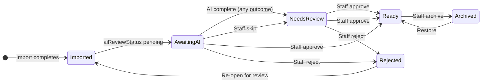

# Plan: Phase 5 — AI Review Workflow Architecture

| Field | Value |
|-------|-------|
| Date | 2026-06-24 |
| Author | Planning Agent |
| Status | **approved_with_conditions** — see `docs/workflow/reviews/phase-5-ai-review-architecture-review.md` |
| Workflow | managed-phase — planning only |
| Prerequisite | Phase 4 signoff — `docs/workflow/reviews/phase-4-signoff.md` |
| Related | `docs/workflow/plans/phase-4-catalog-cleanup-plan.md`, `docs/architecture/ADR-Application-Platform-Strategy.md`, Phase 3D AI review foundation |
| Refinement | 2026-06-24 — final architecture review before implementation |

---

## Architecture refinement summary (2026-06-24)

Fresh Prints Studio is **three independent workspaces**:

| Workspace | Route | Role |
|-----------|-------|------|
| **Imports** | `/imports` | Receive, validate, create designs, derivatives, **automatic AI enqueue** |
| **AI Processing** | `/ai-review` | Process imported designs — AI metadata review and staff approval |
| **Design Library** | `/designs` | Approved catalog only (`ready` / archived view) — not a work queue |

**Simplifications:** Processing tab (not Pending); no Firestore review drafts; confidence informational only; automatic AI on import; staff **processing station** for high-throughput review.

### Phase 5A UX correction (2026-06-24)

Manual workflow review found the initial inbox UI too elaborate for Fresh Prints staff workflow. **5A correction** (implemented):

| Removed | Rationale |
|---------|-----------|
| Search input | Designs arrive without meaningful names — not searchable yet |
| Category filter | Categories assigned during processing, not before |
| Sort dropdown | Fixed **oldest first** queue order for FIFO processing |

| Kept | Rationale |
|------|-----------|
| Processing / Needs Review / Rejected tabs | Represent processing flow states |
| Left queue + right workspace layout | Optimized click → review → approve → next |
| Catalog metadata form | Staff edits final title, category, tags, description |

**Staff-facing label:** **AI Processing** (sidebar + shell title). Route remains `/ai-review`. Search and filtering stay in the Design Library.

**Phase 5A workspace polish (2026-06-24):** Right panel redesigned as a vertical processing workstation: image preview → Processing Status pipeline → AI Suggestions (5B-ready) → Final Catalog Information → actions. Queue panel adds live tab counts above tabs.

**Phase 5B placeholder:** AI output shows honest pipeline and suggestion placeholders — no fabricated values.

---

## Goal

Design the complete **AI Review** workflow for **Fresh Prints Studio** before implementation. AI Review is the operational **Inbox** — every imported design lands here. Approved designs enter the Design Library (`status: ready`); imported and rejected designs never appear in catalog browse.

**This document is planning only.** No code, Firestore schema deploy, rules, or UI changes in this phase.

---

## 1. Complete lifecycle

### 1.1 End-to-end flow

```txt
Import (PNG / batch / ZIP)
    ↓
Firestore design created: status = imported, aiReviewStatus = pending
    ↓
Derivatives complete (thumbnail, preview) — status may remain imported
    ↓
AI enrichment job queued **automatically** (no manual "Generate AI" for new imports)
    ↓
AI generates suggestions (title, category, description, tags)
    ↓
aiReviewStatus → needs_review when AI completes (success, partial, or failure)
    ↓
Design appears in AI Review Inbox (Processing → Needs Review tabs)
    ↓
Staff opens item, reviews preview + AI suggestions
    ↓
Staff edits fields if desired
    ↓
Approve → catalogApprovalService.approveDesignForCatalog
         → status = ready, aiReviewStatus = approved
    ↓
Design appears in Design Library (approved catalog)
```

### 1.2 Rejection and re-review

```txt
Staff rejects → catalogApprovalService.rejectDesignFromCatalog
             → status = rejected, aiReviewStatus = rejected
    ↓
Design hidden from Design Library
    ↓
Remains in AI Review "Rejected" tab for audit and re-review
    ↓
Owner/admin may "Re-open for review" → status = imported, aiReviewStatus = pending or needs_review
    ↓
Re-enters Processing or Needs Review (optional re-run AI)
```

Rejected designs are **not permanently deleted**. They stay queryable in AI Review for later correction, re-import context, or approval reversal.

### 1.3 Skip workflow

```txt
Staff skips (cannot decide now) → designAiReviewService.markAiReviewNeedsReview
    ↓
aiReviewStatus = needs_review, status stays imported
    ↓
Appears in "Needs review" queue tab
    ↓
Staff returns later → approve or reject
```

**Skip ≠ reject.** Skipped items remain in the pipeline.

### 1.4 Lifecycle diagram



### 1.5 Catalog vs AI Review status (approved model)

| Layer | Values | Purpose |
|-------|--------|---------|
| **Catalog `status`** | `imported`, `processing` (transient), `ready`, `rejected`, `archived` | Catalog visibility and lifecycle |
| **`aiReviewStatus`** | `pending`, `needs_review`, `approved`, `rejected` | AI Review queue and outcome |

**Design Library** queries only `status: ready` (plus optional `archived` toggle). Never `imported`, `rejected`, or `processing`.

| `status` | `aiReviewStatus` | Design Library | AI Review queue |
|----------|------------------|----------------|-----------------|
| `imported` | `pending` | Hidden | **Processing** |
| `imported` | `needs_review` | Hidden | **Needs review** |
| `imported` | `approved` (unusual without ready) | Hidden | — |
| `ready` | `approved` | **Visible** | — |
| `rejected` | `rejected` | Hidden | Rejected |
| `archived` | any | Hidden unless archived toggle in library | — |

**Approve** must atomically set `status: ready` + `aiReviewStatus: approved` via `catalogApprovalService` (already implemented).

---

## 2. AI Review queue design

### 2.1 Queue tabs

| Tab | Query (server) | Purpose |
|-----|----------------|---------|
| **Processing** | `status in [imported, processing]` + `aiReviewStatus == pending` | Awaiting derivatives and/or AI enrichment |
| **Needs review** | `status == imported` + `aiReviewStatus == needs_review` | AI complete (or failed); ready for human review |
| **Rejected** | `status == rejected` | Staff-rejected; available for re-open and audit |

**UI label vs persisted field:** Tab **Processing** maps to `aiReviewStatus: pending`. The old **Pending** tab label is removed to avoid confusion with the enum value.

**Queue flow:**

```txt
Processing → Needs Review → Approve → Design Library
                         └→ Reject → Rejected tab
```

Legacy imports without `aiReviewStatus` display as `pending` (existing `resolveDesignAiReviewDisplay`).

### 2.2 Sort order

| Mode | Default | Firestore `orderBy` | Use case |
|------|---------|---------------------|----------|
| **Oldest first** | **Yes** (default) | `createdAt asc` or `updatedAt asc` | Fair FIFO; clear backlog |
| **Newest first** | Optional toggle | `createdAt desc` | Recent imports first |
| **Priority** | Phase 5E / backlog | `aiReviewPriority desc`, then `createdAt asc` | Future: flag urgent imports |

**Recommendation:** Ship **oldest first** as the only queue order in 5A (no sort UI). Defer newest-first toggle and explicit priority field until metrics show need.

### 2.3 Pagination

Reuse Design Library pattern: cursor pagination, 50–100 items per page, load more. **No client search in 5A** — search belongs in Design Library.

### 2.4 Concurrent review / locking

| Approach | Recommendation |
|----------|----------------|
| **No lock** | Simple; risk two staff approve same item |
| **Soft lock** | `aiReviewLockedBy`, `aiReviewLockedAt` on design; 15-minute TTL; owner/admin can force unlock |
| **Hard lock** | Firestore transaction on open — heavier |

**Recommendation (OD-1):** **Soft lock in Phase 5C** when staff opens review detail. Show banner if another user holds lock. Helpers and admins see read-only until lock expires or holder closes. Not required for 5A queue list.

### 2.5 Re-review workflow

| Action | Service | Result |
|--------|---------|--------|
| Re-open rejected | `designAiReviewService.markAiReviewPending` + `designService` set `status: imported` | Returns to Processing or Needs Review |
| Re-run AI | `aiEnrichmentService.enqueue(designId)` | New suggestions; version bump |
| Approve after reject | `catalogApprovalService.approveDesignForCatalog` | `ready` |

Only **owner/admin** may approve, reject, re-open, and re-run AI (existing permissions).

---

## 3. AI-generated fields

### 3.1 Fields to generate

| Field | AI output | Persisted on approve | Notes |
|-------|-----------|----------------------|-------|
| **Title** | `aiSuggestions.title` | `design.title` | From filename + vision; max 200 chars |
| **Category** | `aiSuggestions.categoryId` | `design.categoryId` | Must match active category or null |
| **Description** | `aiSuggestions.description` | `design.description` | Short catalog copy; max ~500 chars |
| **Tags** | `aiSuggestions.tags[]` | `design.tags` | Normalized; max 20 tags, 40 chars each |

Filename at import may seed initial `title` (sanitized basename) until AI overwrites suggestions.

### 3.2 Ownership model

```txt
┌─────────────────────────────────────┐
│ aiSuggestions (AI-owned, versioned) │  ← Written only by AI enrichment pipeline
│  - title, description, categoryId   │
│  - tags, confidence, generatedAt    │
│  - provider, model, promptVersion   │
└─────────────────────────────────────┘
              ↓ staff copies/edits into
┌─────────────────────────────────────┐
│ Temporary form state (Approval Mode)│  ← React state only; NOT persisted to Firestore
│  - optional sessionStorage restore  │
└─────────────────────────────────────┘
              ↓ Approve
┌─────────────────────────────────────┐
│ design catalog fields (staff-owned   │  ← title, description, categoryId, tags
│  after approval)                    │
└─────────────────────────────────────┘
```

**Rules:**

* AI **never** auto-writes catalog fields without staff approve.
* Staff edits in **Approval Mode** update temporary form state; **Approve** persists to design + triggers `catalogApprovalService`.
* **No Firestore `reviewDraft`** in Phase 5 — avoids orphan drafts, extra writes, and rules complexity.
* `aiSuggestions` retained after approval for analytics (edit distance, accuracy).
* Human edits in Design Library post-approval do not mutate `aiSuggestions`.

**Tradeoffs (no persisted draft):**

| Approach | Pros | Cons |
|----------|------|------|
| **Temporary form state (chosen)** | Simple schema; fast review; clear approve boundary | Lost on hard refresh unless optional sessionStorage (5E) |
| Firestore `reviewDraft` | Multi-session resume | Extra writes; stale drafts; security rules surface |

### 3.3 Data model extension (planned — document only)

Extend `designs/{id}` with optional `aiSuggestions` object (align with `AiMetadata` in `DATA_MODEL.md`):

```ts
export interface DesignAiSuggestions {
  title?: string;
  description?: string;
  categoryId?: string;
  tags?: string[];
  confidence?: number;        // overall 0–1; informational only — no auto-routing
  fieldConfidence?: {
    title?: number;
    description?: number;
    categoryId?: number;
    tags?: number;
  };
  provider?: string;          // e.g. "openai", "google"
  model?: string;             // e.g. "gpt-4o"
  promptVersion?: string;     // e.g. "catalog-enrich-v3" — required for regression analysis
  generatedAt?: Timestamp;
  errorCode?: string;         // set on failure
}
```

No migration required for existing imports; field absent until first AI run.

---

## 4. Review interface — Approval Mode

### 4.0 Approval Mode goals

Optimize for **hundreds of designs per session**:

| Control | Behavior |
|---------|----------|
| **Approve & Next** | `catalogApprovalService.approveDesignForCatalog` → advance queue |
| **Reject & Next** | Reject with optional reason → advance |
| **Skip** | Defer decision → Needs Review tab |
| **Previous / Next** | Navigate without persisting |
| **Auto-advance** | User setting: after approve/reject/skip, auto-select next item |
| **Preserve zoom** | Lightbox zoom retained across items in session |
| **Preserve scroll** | Queue list scroll position restored when returning from item |

No manual **Generate AI** for newly imported designs. **Re-run AI** remains per-item (owner/admin).

### 4.1 Page structure (`/ai-review`)

```txt
┌──────────────────────────────────────────────────────────────────┐
│ Page intro: tab description + queue count                          │
├──────────────┬───────────────────────────────────────────────────┤
│ Queue panel  │ Processing workspace (selected item)              │
│              │                                                   │
│ [Tabs]       │  Preview (large) + lightbox                       │
│ Processing   │  AI output card (honest placeholder until 5B)     │
│ Needs Review │  Catalog metadata form (staff edits)              │
│ Rejected     │  [Reject & Next] [Skip] [Approve & Next] [←][→]   │
│              │                                                   │
│ [thumb]      │                                                   │
│ Title…       │                                                   │
│ [status]     │                                                   │
│ Imported…    │                                                   │
└──────────────┴───────────────────────────────────────────────────┘
```

**No search, category filter, or sort controls.** Queue order: oldest first (client-side after fetch).

### 4.2 Component recommendations

| Area | Recommendation | Reuse |
|------|----------------|-------|
| **Image preview** | `DesignThumbnailPanel` / preview path resolver | Phase 3C |
| **Zoom / lightbox** | `DesignPreviewLightbox` | Design Library details |
| **Side-by-side** | Optional "Compare" toggle: AI suggestion vs staff draft vs current filename | Phase 5C |
| **Editable fields** | Adapt `DesignFormFields` patterns; category from active categories | Phase 2C |
| **Tag editor** | Chip input with normalization | `designTagNormalizer` |
| **Actions** | Approve, Reject (with reason modal), Skip, Next, Previous | New |

### 4.3 Empty states

| State | Message |
|-------|---------|
| No processing items | "Queue clear — new imports will appear in Processing." |
| AI still running | "AI enrichment in progress…" with spinner on row |
| AI failed | Badge + manual entry allowed; `needs_review` tab |

### 4.4 Keyboard shortcuts (recommended)

| Key | Action |
|-----|--------|
| `A` | Approve and next |
| `R` | Reject (opens reason modal) |
| `S` | Skip (needs review) |
| `J` / `K` | Next / previous item |
| `P` | Toggle preview lightbox |
| `Esc` | Close lightbox / deselect |

Shortcuts disabled when focus is in text inputs.

---

## 5. Bulk review

### 5.1 AI processing scope

| Mode | Phase | Description |
|------|-------|-------------|
| **Per-design on import** | 5B | Each import **automatically** enqueues one AI job after derivatives |
| **On-demand re-run** | 5B | Staff button "Re-run AI" on one design (not for new imports) |
| **Bulk AI re-run** | Backlog | Select multiple → enqueue; no UI in initial 5 |
| **Bulk approve** | **Not recommended for 5** | High risk; defer to backlog with strong safeguards |

### 5.2 Recommendation

* **AI generation:** Background queue after import (batch-friendly at infrastructure level).
* **Staff review:** **One design at a time** in UI for Phase 5C–5D.
* **Bulk approve:** Out of scope for Phase 5; revisit after analytics show low edit rates.

---

## 6. Failure handling

| Failure | Detection | System behavior | Staff UX |
|---------|-------------|-----------------|----------|
| **AI API failure** | HTTP error, timeout | `aiReviewStatus: needs_review`, `aiSuggestions.errorCode`, `aiProcessed: false` | Banner: "AI unavailable — enter metadata manually" |
| **Invalid category** | AI returns unknown ID | Discard category suggestion; `fieldConfidence.categoryId` low | Dropdown empty; staff must pick |
| **Duplicate title** | Service check against `ready` designs | Warning only; do not block approve | "Similar title exists" with link |
| **Low confidence** | `confidence < threshold` | **No auto-routing** — badge/highlight fields only; staff always approves | Highlight fields needing attention |
| **Partial AI response** | Missing fields | Fill available; flag incomplete | Show which fields failed |
| **Rate limit** | Provider 429 | Retry with backoff; max 3 attempts | Queue item shows "Retrying…" |

Approve path **always allowed** with manual metadata when AI fails (owner/admin).

### 6.1 Duplicate title check

`aiReviewValidationService.checkDuplicateTitle(title, excludeDesignId)` — query `designs` where `status == ready` and title equals (case-insensitive). Warning only in Phase 5.

---

## 7. Performance and AI architecture

### 7.1 Confidence policy

**Confidence is informational only.** Do not route designs between tabs based on confidence. When AI completes, transition to `needs_review` unconditionally. Staff approval is always required for catalog publish. Low confidence draws attention to specific fields via badges — it does not automate decisions.

### 7.2 Processing strategy

| Option | Pros | Cons | Verdict |
|--------|------|------|---------|
| **Immediate after import** | Fastest staff feedback | Blocks import UX if synchronous | **No** — async only |
| **Background worker (Cloud Function)** | Secure API keys; scalable | Infra complexity | **Recommended for production** |
| **On-demand only** | Simple | Staff waits per item | Fallback / dev |
| **Desktop Electron job** | No cloud deploy | API keys in desktop; less secure | **Dev-only** optional |

### 7.3 Recommended architecture

```txt
Import orchestration (Studio)
    ↓
designService.createDesign (imported, pending)
    ↓
enqueueAiEnrichment(designId)  — explicit call after derivatives complete (OD-7)
    ↓
Cloud Function: aiEnrichmentWorker
    - Load thumbnail or preview from Storage
    - Call vision + text model (API key in Secret Manager)
    - Validate category against categories collection
    - Write aiSuggestions (provider, model, promptVersion, generatedAt)
    - Set aiReviewStatus: needs_review, aiProcessed: true, aiReviewVersion
    ↓
AI Review queue updates in real time (onSnapshot or poll)
```

### 7.4 Batching

| Layer | Strategy |
|-------|----------|
| **Import batch** | Enqueue one message per design; concurrency limit 3–5 |
| **Provider API** | Batch only if provider supports; else parallel with rate limit |
| **Staff UI** | No batching; single-item review |

### 7.5 Cost controls

* Process **preview WebP** for vision, not full PNG (lower cost).
* Skip re-AI if `aiSuggestions.generatedAt` recent and staff only changed tags.
* Owner setting: daily AI job cap (future).

---

## 8. Permissions

Aligned with `permissionService` and `SECURITY.md` (implemented).

| Action | Owner | Admin | Helper |
|--------|-------|-------|--------|
| View AI Review page / queue | Yes | Yes | Yes |
| View AI suggestions | Yes | Yes | Yes |
| Edit review form fields | Yes | Yes | **Read-only** (OD-2 resolved) |
| Skip → needs_review | Yes | Yes | **Optional** — recommend Yes |
| Approve → catalog ready | Yes | Yes | **No** |
| Reject | Yes | Yes | **No** |
| Re-open rejected | Yes | Yes | No |
| Re-run AI | Yes | Yes | No |
| Force unlock | Yes | Yes | No |

**Recommendation (OD-2):** Helpers may **view** queue and **skip** items, but **cannot approve/reject** or edit fields that would be persisted on approve.

### 8.1 Rejected terminology

**Recommendation: keep "Rejected"** for tab label, buttons, and persisted enums (`status: rejected`, `aiReviewStatus: rejected`). Clear gate vocabulary; designs are retained for audit and re-open — not deleted. Alternatives (Discarded, Hidden, Not Accepted) imply deletion or obscure the decision.

Sidebar AI Review entry: use `viewAiReview` permission (all staff) vs `manageAiReview` for action buttons.

---

## 9. Security review

| Topic | Requirement |
|-------|-------------|
| **API keys** | Never in renderer or client bundle; Cloud Function + Secret Manager |
| **AI input** | Preview/thumbnail bytes only; no customer PII in prompt |
| **Prompt injection** | Treat filename as untrusted; sanitize |
| **Firestore rules** | Staff read/write designs; block client writes to `aiSuggestions` except via trusted path — prefer Cloud Function writes for AI fields |
| **Approve path** | `catalogApprovalService` + rules validation on `status` transitions |
| **Audit** | Log approve, reject, re-open, re-run AI to `auditLogs` |
| **Helpers** | Enforce `canApproveDesignForCatalog` server-side in services (already) |

Production AI provider selection requires **human approval** per `human-checkpoints.mdc`.

---

## 10. Metrics and analytics (Phase 5E)

### 10.1 Recommended metrics

| Metric | Source | Purpose |
|--------|--------|---------|
| Average review time | `aiReviewedAt - firstOpenedAt` or audit log | Throughput |
| Approval rate | approved / (approved + rejected) | AI quality |
| Manual edit % | compare `aiSuggestions` vs final on approve | Model tuning |
| Rejected % | rejected / total reviewed | Quality gate |
| AI confidence distribution | `aiSuggestions.confidence` | Threshold tuning |
| Category accuracy | staff changed category? | Prompt improvement |
| Tag accuracy | Jaccard similarity AI vs final tags | Prompt improvement |
| AI failure rate | `errorCode` present | Reliability |
| Queue depth | count pending + needs_review | Staffing |

### 10.2 Storage

| Phase | Approach |
|-------|----------|
| **5E** | Emit structured `auditLogs` events on approve/reject with metadata snapshot |
| **Future** | `aiReviewMetrics` daily rollups or BigQuery export |

Do not block 5A–5D on analytics dashboard.

---

## 11. Implementation sequencing

### Phase 5 breakdown

| Sub-phase | Name | Scope | Exit criteria |
|-----------|------|-------|---------------|
| **5A** | Processing station | Tabs + queue stats; oldest-first list; workflow workspace (preview → pipeline → AI suggestions → catalog form → actions); **no search/filter/sort** | Staff process imported designs in correct tabs |
| **5B** | Automatic AI pipeline | Cloud Function, `aiSuggestions` + version fields, enqueue on import | AI runs before staff opens AI Review |
| **5C** | Approval Mode workspace | Preview, form, temp state, Approve/Reject/Skip & Next, shortcuts, auto-advance, zoom/scroll preserve | Staff process hundreds of designs efficiently |
| **5D** | Promotion & audit | Wire Approve/Reject to `catalogApprovalService`, re-open rejected, duplicate title warning, audit logs | Approved → Design Library; rejected → Rejected tab |
| **5E** | Polish & metrics | Confidence badges, soft lock, re-run AI, sessionStorage optional, performance tuning | Core metrics and polish |

### Dependency graph

```txt
5A Inbox ──→ 5C Approval Mode ──→ 5D Promotion
                ↑
5B Auto AI ─────┘
                ↓
              5E Polish
```

**5B** may start in parallel with **5A** (different owners). **5C** requires 5A; **5D** requires 5C. **5B** should complete before staff-facing AI suggestions in 5C, but 5C can use mock suggestions until 5B lands.

### Roadmap alignment

Update `ROADMAP.md` Phase 5 to reference sub-phases 5A–5E when this plan is approved.

---

## 12. Testing strategy

### Automated

| Layer | Tests |
|-------|-------|
| Services | `catalogApprovalService`, `designAiReviewService`, new `aiReviewQueueService` query builders |
| Validation | duplicate title, category validation, tag normalization on approve |
| AI adapter | Mock provider; no live API in CI |
| Lint / tsc | Required |

### Manual (Fresh Prints Studio)

| # | Scenario |
|---|----------|
| 1 | Import design → appears in Processing tab, not Design Library |
| 2 | AI completes automatically → suggestions visible in Needs Review |
| 3 | Edit title/tags in Approval Mode → Approve → visible in Design Library |
| 4 | Reject & Next → Rejected tab; not in library |
| 5 | Re-open rejected → Processing or Needs Review |
| 6 | Skip → Needs review tab |
| 7 | Helper can view but cannot approve |
| 8 | AI failure → manual approve still works |
| 9 | Duplicate title warning |
| 10 | Approve & Next, keyboard shortcuts, auto-advance |

### Human checkpoints

* AI provider and API key setup (production)
* Prompt / category mapping review
* Helper permissions confirmation (OD-2)

---

## 13. Risks

| Risk | Severity | Mitigation |
|------|----------|------------|
| API cost spike on large batch import | High | Rate limits, preview-only vision, daily cap |
| Helpers expect approve access | Medium | Clear UI disable + docs |
| Two staff approve same design | Medium | Soft lock in 5C |
| AI bad category pollutes catalog | High | Validate against active categories; staff must confirm |
| Cloud Function complexity | Medium | Dev mock adapter for 5A–5C local work |
| Scope creep into bulk approve | Medium | Explicitly deferred |
| `aiSuggestions` schema churn | Low | Version field; document in DATA_MODEL before 5B |

---

## 14. Open decisions

| ID | Topic | Options | Recommendation | Status |
|----|-------|---------|----------------|--------|
| OD-1 | Review locking | None vs soft lock | Soft lock in 5E | Open |
| OD-2 | Helper edit rights | View-only vs edit-without-approve | View + skip only | **Resolved** |
| OD-3 | AI provider | OpenAI / Google / Anthropic | Human choice at 5B kickoff | Open |
| OD-4 | Confidence routing | Auto-route vs informational | **Informational only** — no auto-routing | **Resolved** |
| OD-5 | Sort default | Oldest vs newest first | Oldest first | **Resolved** |
| OD-6 | Persist review draft | Firestore vs local state | **Local state only**; optional sessionStorage in 5E | **Resolved** |
| OD-7 | Cloud Function vs callable | Trigger on create vs explicit enqueue | Explicit enqueue after derivatives | **Resolved** |
| OD-8 | sessionStorage restore | None vs per-design session | Optional 5E polish | Open |
| OD-9 | Re-open target tab | Processing vs Needs Review | Needs Review (staff sees suggestions) | Recommend |

---

## 15. Final recommendation

Proceed with Phase 5 in order **5A → 5B (parallel OK) → 5C → 5D → 5E**.

1. **Build the Inbox queue first** (Processing, Needs Review, Rejected) — AI Review is the operational inbox for all imports.
2. **Enqueue AI automatically** after import + derivatives; no manual Generate AI for new imports.
3. **Ship Approval Mode** with temporary form state — no Firestore review drafts.
4. **Wire approve/reject** to existing `catalogApprovalService` — do not duplicate catalog logic.
5. **Confidence informational only** — staff always approves; no confidence-based routing.
6. **Track AI versions from day one** — `provider`, `model`, `promptVersion`, `generatedAt`.
7. **Keep "Rejected" terminology** — designs retained for audit and re-open.
8. **Keep helpers view-only** for approval; owners/admins gate catalog quality.
9. **Defer bulk approve** until metrics justify complexity.

**Architecture review:** `docs/workflow/reviews/phase-5-ai-review-architecture-review.md` — **APPROVED WITH CONDITIONS**.

**Do not implement** until workflow state transitions to approved implementation phase.

---

## 16. Documentation updates (post-approval)

| Doc | Update when |
|-----|-------------|
| `DATA_MODEL.md` | `aiSuggestions` schema before 5B |
| `WORKFLOWS.md` | Full AI Review workflow after 5D |
| `SECURITY.md` | Cloud Function AI rules before 5B deploy |
| `BACKEND.md` | AI provider env vars before 5B |
| `ROADMAP.md` | Sub-phases 5A–5E on plan approval |

---

## Approval

- Review doc: `docs/workflow/reviews/phase-5-ai-review-architecture-review.md`
- Verdict: **approved_with_conditions**
