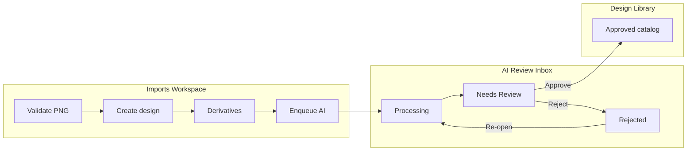

# Review: Phase 5 — AI Review Workflow Architecture (Refinement)

| Field | Value |
|-------|-------|
| Date | 2026-06-24 |
| Reviewer | Architecture review (post–Phase 4 signoff) |
| Plan | `docs/workflow/plans/phase-5-ai-review-architecture-plan.md` |
| Prerequisite | Phase 4 signoff — `docs/workflow/reviews/phase-4-signoff.md` |
| Verdict | **APPROVED WITH CONDITIONS** |

---

## Executive summary

Phase 5 architecture is **refined and approved for implementation planning** after aligning with the evolved business workflow:

```txt
Import → automatic AI processing → AI Review (Inbox) → Approve → Design Library
```

**Fresh Prints Studio** is three independent workspaces — **Imports**, **AI Review**, **Design Library** — with no overlap in responsibility.

Key simplifications:

| Removed / avoided | Replaced with |
|-------------------|---------------|
| Pending queue tab | **Processing** tab |
| Ready + archived combined library query | Already fixed in Phase 4 (archived-only toggle) |
| Persisted `reviewDraft` in Firestore | **Temporary form state** in Approval Mode UI |
| Confidence-based auto-routing to Needs Review | **Informational badges only** |
| Manual “Generate AI” for new imports | **Automatic enqueue** after import + derivatives |

---

## Architecture findings

### 1. Three workspaces (official)

| Workspace | Route | Responsibility | Must NOT |
|-----------|-------|----------------|----------|
| **Imports** | `/imports` | Receive PNGs/ZIP/batch; validate; create design records; generate derivatives; **enqueue AI** | Approve catalog; browse approved catalog |
| **AI Review** | `/ai-review` | Operational **Inbox** for all post-import designs until approved or rejected | Show approved catalog; replace import validation |
| **Design Library** | `/designs` | Approved catalog browse/search/edit (`ready` / archived-only view) | Show imported or rejected designs; import queue |



### 2. AI Review is the Inbox

Every imported design lands in AI Review. Design Library **never** displays `imported`, `processing`, or `rejected` designs.

Staff mental model: **Inbox = work to do**; **Library = finished catalog**.

### 3. Automatic AI processing

Immediately after successful import orchestration:

1. `designService.createDesign` (`status: imported`, `aiReviewStatus: pending`)
2. Derivatives complete (thumbnail, preview)
3. **`enqueueAiEnrichment(designId)`** — no staff action required

AI should be running or queued before staff opens AI Review. **No “Generate AI” button for newly imported designs.**

Manual **Re-run AI** remains on individual items (owner/admin) after initial processing.

### 4. Queue states (renamed)

| Tab (UI) | Firestore query (summary) | Meaning |
|----------|---------------------------|---------|
| **Processing** | `status in [imported, processing]` + `aiReviewStatus == pending` | Waiting for derivatives and/or AI enrichment |
| **Needs Review** | `status == imported` + `aiReviewStatus == needs_review` | AI complete (or failed); ready for human review |
| **Rejected** | `status == rejected` | Staff rejected; audit and re-open |

**Removed:** “Pending” tab label (confusing vs `pending` enum value). UI uses **Processing**; persisted field remains `aiReviewStatus: pending` until AI completes.

### 5. Queue flow

```txt
Import
  ↓
Processing  (aiReviewStatus: pending)
  ↓ AI worker completes (success or partial failure)
Needs Review  (aiReviewStatus: needs_review)
  ↓
  ├─ Approve → status: ready → leaves inbox → Design Library
  └─ Reject  → status: rejected → Rejected tab

Rejected tab
  ↓ Re-open (owner/admin)
Processing or Needs Review (per re-open rules)
```

**Skip** moves item to **Needs Review** without rejecting (defer decision). Skip ≠ reject.

### 6. Review drafts — recommendation: NO persisted draft

**Recommended model:**

```txt
aiSuggestions (AI-owned, Firestore, versioned)
       ↓ copy into
Temporary form state (React — Approval Mode)
       ↓ Approve
design catalog fields + catalogApprovalService
```

| Approach | Pros | Cons |
|----------|------|------|
| **Temporary form state (recommended)** | Simple schema; no orphan drafts; clear approve boundary; matches fast review UX | Lost on hard refresh unless optional sessionStorage |
| Persisted Firestore `reviewDraft` | Multi-session resume | Extra writes; sync complexity; stale drafts; security rules surface |

**Decision:** Do **not** persist review drafts to Firestore in Phase 5. Optional **sessionStorage** restore per `designId` in same browser session is acceptable polish (5E), not required for 5C.

### 7. Approval Mode (review workspace)

Optimize for **hundreds of designs per session**:

| Control | Behavior |
|---------|----------|
| **Approve & Next** | `catalogApprovalService.approveDesignForCatalog` → advance queue |
| **Reject & Next** | Reject with optional reason → advance |
| **Skip** | `markAiReviewNeedsReview` (if not already) → advance |
| **Previous / Next** | Navigate queue without persisting |
| **Auto-advance** | Setting: after approve/reject/skip, automatically select next item |
| **Preserve zoom** | Lightbox zoom level retained across items in session |
| **Preserve scroll** | Queue list scroll position restored when returning from item |

**Keyboard shortcuts:** `A` approve+next, `R` reject, `S` skip, `J`/`K` nav (disabled in text fields).

### 8. Confidence scores — informational only

| Principle | Detail |
|-----------|--------|
| **No auto-routing** | Low confidence does **not** move items between tabs |
| **Staff always approves** | No auto-publish to catalog |
| **UI use** | Field-level badges highlight title/category/tags/description for attention |
| **Why** | Predictable queue flow; staff retain judgment; avoids hidden automation errors; simpler queries |

When AI completes, transition to `needs_review` **unconditionally** (success, partial, or failure with manual entry allowed).

### 9. AI version tracking — from day one

Persist on `aiSuggestions` (and audit on approve):

| Field | Purpose |
|-------|---------|
| `provider` | e.g. `openai`, `google` |
| `model` | e.g. `gpt-4o`, `gemini-2.0-flash` |
| `promptVersion` | e.g. `catalog-enrich-v3` — **critical for regression analysis** |
| `generatedAt` | When suggestions were produced |

**Why `promptVersion`:** Prompts will change frequently. Without version tagging, teams cannot compare approval rates, edit distance, or category accuracy across prompt iterations. Enables safe A/B rollout and rollback reasoning.

Also retain existing `aiReviewVersion` on design for compatibility.

### 10. Rejected terminology — recommendation: **Rejected**

| Term | Assessment |
|------|------------|
| **Rejected** ✓ | Matches `status` / `aiReviewStatus`; clear gate; standard review vocabulary |
| Declined | Softer; ambiguous with customer-facing language |
| Discarded | Implies deletion; designs are retained |
| Not Accepted | Verbose; weak action label |
| Hidden | Describes effect, not decision |
| Removed | Implies delete |

**Recommendation:** Keep **Rejected** for tab label, buttons (“Reject & Next”), and persisted enums. Designs are **not deleted** — copy clarifies “Rejected designs remain in AI Review for audit and re-open.”

### 11. Simplifications made (vs original plan)

| Original complexity | Refinement |
|--------------------|------------|
| Pending + Needs Review overlap | Clear **Processing** vs **Needs Review** |
| Optional Firestore `reviewDraft` (OD-6) | **Removed** — temporary form state only |
| Confidence threshold auto `needs_review` (OD-4) | **Removed** — informational only |
| Low-confidence auto-tab routing | AI completion → `needs_review` always |
| Manual AI trigger for new imports | **Automatic enqueue** only |
| Bulk approve | Still **deferred** |
| In-review tab (5C+) | **Deferred** to 5E soft lock (optional) |

### 12. Implementation sequencing (updated)

| Sub-phase | Name | Scope |
|-----------|------|-------|
| **5A** | Inbox queue | Tabs: Processing, Needs Review, Rejected; queries; pagination; sort; list UI |
| **5B** | Automatic AI pipeline | Enqueue on import; Cloud Function worker; `aiSuggestions` + version fields |
| **5C** | Approval Mode | Preview, form from suggestions, temp state, Approve/Reject/Skip & Next, shortcuts, auto-advance |
| **5D** | Promotion & audit | `catalogApprovalService` wiring, re-open rejected, duplicate title warning, audit logs |
| **5E** | Polish & metrics | Confidence badges, soft lock, re-run AI, analytics events, sessionStorage optional |

```txt
5A Inbox ──→ 5C Approval Mode ──→ 5D Promotion
                ↑
5B Auto AI ─────┘
                ↓
              5E Polish
```

**5B** may start parallel with **5A**. **5C** requires 5A list; may use mock suggestions until 5B lands. **Do not** merge 5B into import UX synchronously.

---

## Removed complexity

* Firestore-persisted review drafts
* Confidence-based queue routing
* “Pending” as user-facing queue name
* Manual AI generation for new imports
* Combined ready+archived inbox/library confusion (resolved Phase 4)

---

## Open decisions (remaining)

| ID | Topic | Recommendation | Status |
|----|-------|----------------|--------|
| OD-1 | Soft lock | Defer to 5E; not required for 5A | Open |
| OD-2 | Helper rights | View + skip; no approve/reject/edit persist | **Resolved** |
| OD-3 | AI provider | Human choice at 5B kickoff | Open |
| OD-5 | Sort default | Oldest first (FIFO backlog) | **Resolved** |
| OD-6 | Persist review draft | **No Firestore draft** | **Resolved** |
| OD-7 | Enqueue pattern | Explicit enqueue after derivatives (not trigger-only) | **Resolved** |
| OD-8 | sessionStorage draft | Optional 5E; not blocking | Open |
| OD-9 | Re-open rejected target tab | Needs Review (staff sees AI suggestions immediately) | Recommend |

---

## Risks

| Risk | Severity | Mitigation |
|------|----------|------------|
| AI cost on large batch import | High | Async worker; preview-only vision; rate limits |
| 5B delayed blocks real suggestions in 5C | Medium | Mock adapter; Processing tab still useful |
| Lost form state on refresh | Low | sessionStorage optional; fast approve flow |
| Helper expects approve | Medium | UI disable + permissions (existing) |
| Prompt churn without version field | Medium | **promptVersion** required in 5B schema |
| Production AI secrets | High | Human checkpoint before 5B deploy |

---

## Documentation updated

| Document | Changes |
|----------|---------|
| `phase-5-ai-review-architecture-plan.md` | Refinement integrated |
| `WORKFLOWS.md` | Three workspaces; Inbox flow; Approval Mode |
| `ARCHITECTURE.md` | Studio workspace model |
| `PROJECT_BRIEF.md` | Current focus Phase 5; three workspaces |
| `DATA_MODEL.md` | `aiSuggestions` + version fields (planned) |
| `ROADMAP.md` | Phase 5 refined sub-phases |
| `DECISIONS.md` | ADR-FP-009 |

---

## Signoff recommendation

### **APPROVED WITH CONDITIONS**

Phase 5 architecture is **ready for implementation** after this refinement.

**Conditions:**

1. **Human checkpoint** before production AI provider and Secret Manager setup (5B).
2. **DATA_MODEL.md** `aiSuggestions` schema finalized in 5B planning gate (no deploy before doc).
3. **OD-3** AI provider selected before 5B implementation starts.

**Do not implement** until workflow state transitions to approved implementation phase.

---

## Exit criteria (architecture)

| Criterion | Met |
|-----------|-----|
| Three workspaces documented | Yes |
| Inbox vs Library separation clear | Yes |
| Automatic AI on import documented | Yes |
| Queue states renamed and queried | Yes |
| No persisted review draft | Yes |
| Approval Mode documented | Yes |
| Confidence informational only | Yes |
| Version tracking defined | Yes |
| Rejected terminology decided | Yes |
| Phase sequencing updated | Yes |

---

## Amendment: Phase 5A UX correction (2026-06-24)

Post-implementation manual review: initial 5A inbox UI included search, category filter, and sort — inappropriate for designs that arrive without meaningful metadata.

**Approved correction (no re-review required):**

* Remove search, category filter, and sort from AI Processing page
* Staff label **AI Processing**; route `/ai-review` unchanged
* Fixed oldest-first queue order
* Honest AI output placeholder until Phase 5B
* Search/filter remains Design Library responsibility

Architecture verdict unchanged: **APPROVED WITH CONDITIONS**.

---

## Amendment: Phase 5A workspace polish (2026-06-24)

Right-panel redesign: vertical processing workstation (preview → pipeline status → AI suggestions → final catalog form → actions). Queue tab counts above tabs. Sidebar order: Design Library → AI Processing → Imports. No schema or backend changes.
